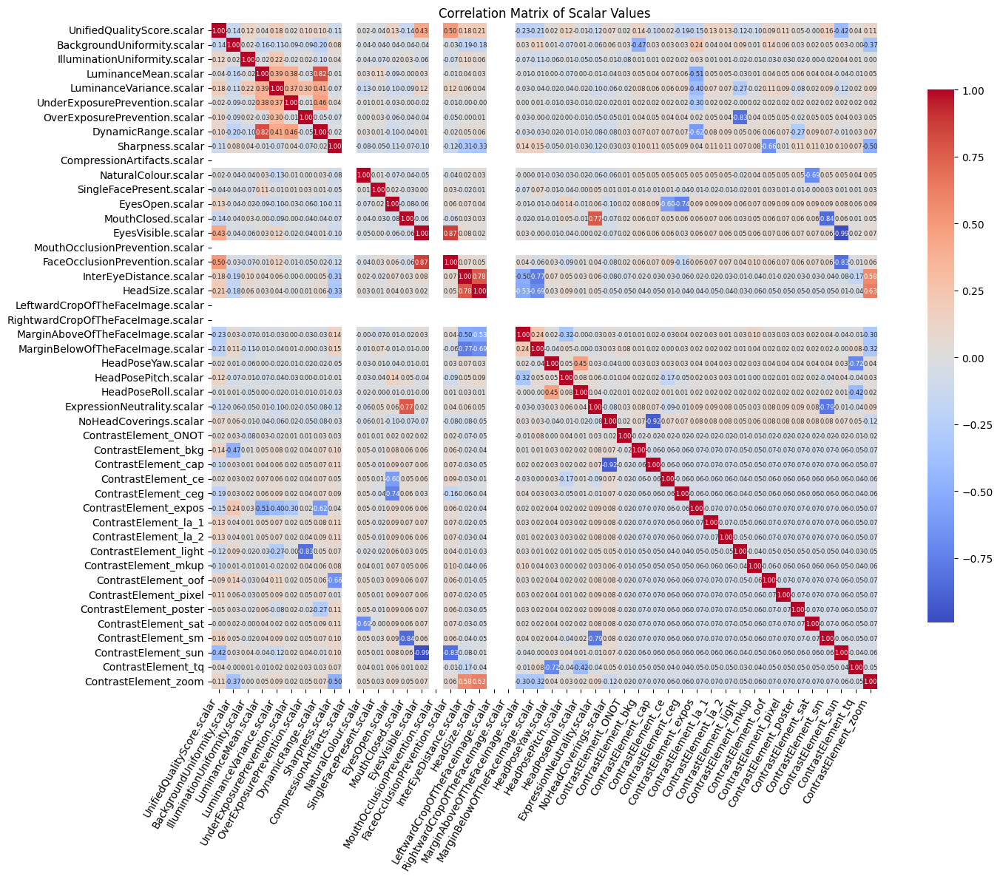

# Biometrics project

This is a project to describe quality issues in biometric images based on the
OFIQ assessment (Open Source Face Image Quality). This project uses Llama 3.2
to create a human-readable description of the quality issues in biometric
images. The step-by-step analysis may be found in the Jupyter notebook
[`analysis.ipynb`](./analysis.ipynb).

## Setup

```bash
# Clone repository and submodules.
git clone https://github.com/olablachowiak/biometrics-project --recursive
# Create a virtual environment.
python3 -m venv .venv
# Activate the virtual environment.
source .venv/bin/activate
```

You will also need to have Ollama available on a network endpoint for remote
LLM inference.

## Correlation analysis

Below you can find a screenshot of the correlation analyisis of the OFIQ scores.



## System prompt

```txt
You are an AI assistant specialized in explaining face image quality defects
based on OFIQ (Open Source Face Image Quality) assessment. For each image,
carefully review all OFIQ scores and select defect specific to that image.
Do not assume the same defect for all images; each image may have a different
primary defect. One defect might be a combination of multiple OFIQ scores. Only
mention the scores that are the correlated with the defect. Always start by
stating if the image is compliant or not. Then provide a concise desription of
the defect and actionable feedback for improvement. If no significant defects
are identified, state that the image is fully compliant and no specific defects
were found. Your response should be concise, professional, and easy to
understand. Each image has at maximum one main defect.
```

## Evaluation

For the evaluation of the dataset, the file `llm_generated_explanations7.json` was used. The evaluation was performed on comparing descriptions generated by the LLM and the evaluation descriptions. The [`sentence-transformers`](https://pypi.org/project/sentence-transformers/) library was used to calculate the similarity scores between descriptions.

### Results

| ID  | Contrast element | Mean similarity score |
| --- | ---------------- | --------------------- |
| 0   | NONE             | 0.686293              |
| 1   | bkg              | 0.666084              |
| 2   | cap              | 0.488121              |
| 3   | ce               | 0.648189              |
| 4   | ceg              | 0.668799              |
| 5   | expos            | 0.588615              |
| 6   | la_1             | 0.536129              |
| 7   | la_2             | 0.587794              |
| 8   | light            | 0.652807              |
| 9   | mkup             | 0.610895              |
| 10  | oof              | 0.563482              |
| 11  | pixel            | 0.556000              |
| 12  | poster           | 0.556338              |
| 13  | sat              | 0.660453              |
| 14  | sm               | 0.667491              |
| 15  | sun              | 0.708397              |
| 16  | tq               | 0.630106              |
| 17  | zoom             | 0.651863              |

The result can be summarized as follows:

| Metric                   | Value  |
| ------------------------ | ------ |
| Average similarity score | 0.6182 |
| Standard deviation       | 0.0783 |
